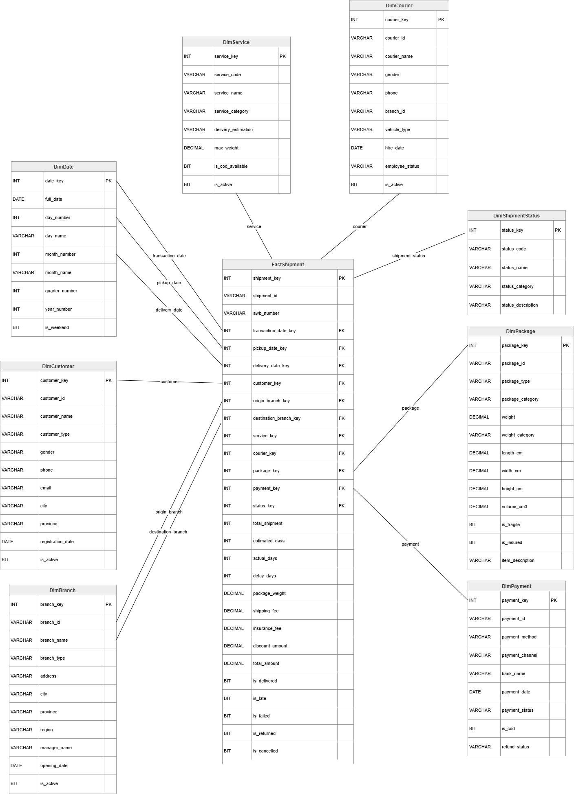
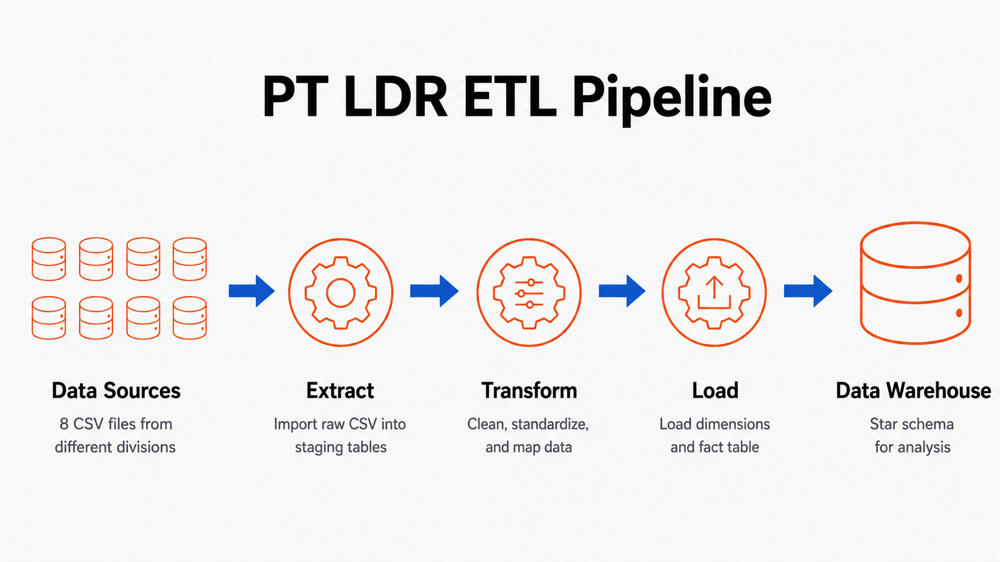

# PT. LDR Data Warehouse ETL Project

## 1. Project Overview

This project is a simulation of a **Data Warehouse ETL process** for **PT. LDR**, a fictional logistics and delivery company. PT. LDR is designed as a reflection of a national-scale expedition and logistics company that handles package delivery, branch operations, courier assignment, customer transactions, payment processing, and shipment tracking.

The main purpose of this project is to demonstrate how dirty and fragmented operational data from several business divisions can be processed through an ETL pipeline and transformed into a structured data warehouse using a **Star Schema**.

The ETL process is implemented using **SQL Server** and SQL scripts.

---

## 2. Business Context

PT. LDR operates in the logistics and delivery service industry. The company handles domestic package delivery across multiple cities in Indonesia. Its operational data comes from several functional areas, such as:

- Logistics / Shipment Operations
- Customer Service / Marketing
- Branch Management
- Courier Management
- Package Manifest
- Finance / Payment
- System Master Data

Before ETL, the data is stored in several CSV files and contains dirty data, such as inconsistent date formats, missing values, inconsistent text values, and mixed numeric formats.

---

## 3. Dataset

The project uses 8 CSV files as raw data sources.

| No | CSV File | Business Area | Description |
|---:|---|---|---|
| 1 | `shipments.csv` | Operational / Logistics | Main shipment transaction data |
| 2 | `customers.csv` | Customer Service / Marketing | Customer master data |
| 3 | `branches.csv` | Branch Management | Branch, outlet, and warehouse data |
| 4 | `services.csv` | Service Management | Delivery service master data |
| 5 | `couriers.csv` | Courier / HR | Courier data |
| 6 | `packages.csv` | Package Manifest | Package detail data |
| 7 | `payments.csv` | Finance | Payment method and payment status data |
| 8 | `shipment_status.csv` | Tracking System | Shipment status master data |

The dataset contains dirty data intentionally to support the ETL process.

Examples of dirty data:

- Different date formats: `2025-01-05`, `05/01/2025`, `Jan 7 2025`, `15-03-2025`
- Mixed money formats: `18000`, `Rp35000`, `120.000`
- Inconsistent status values: `DLV`, `Delivered`, `TERKIRIM`, `GAGAL`
- Missing values in optional fields
- Mixed boolean values: `Yes`, `Active`, `1`, `False`, `N`
- Inconsistent city names such as `JKT Pusat` and `Jakarta Pusat`

The CSV files in `data/` can be reproduced with:

```powershell
python scripts\generate_dummy_data.py
```

Default generated data volume:

| CSV File | Default Rows | Notes |
|---|---:|---|
| `shipments.csv` | 10,000 | Main transaction source |
| `packages.csv` | 10,000 | One package record per shipment |
| `payments.csv` | 10,000 | One payment record per shipment |
| `customers.csv` | 800 | Reused by many shipments |
| `couriers.csv` | 250 | Reused by many shipments |
| `branches.csv` | 40 | Reused as origin and destination branches |
| `services.csv` | 7 | Service master data |
| `shipment_status.csv` | 7 | Shipment status master data |

To generate a larger transaction snapshot:

```powershell
python scripts\generate_dummy_data.py --shipments 10500
```

The generator uses a fixed default seed (`42`). If only `--shipments` is changed, the earlier shipment IDs remain reproducible and the additional IDs are appended, for example `SHP10001` to `SHP10500`.

---

## 4. Database Structure

This project uses 2 databases:

```sql
LDR_Staging
LDR_DW
```

### 4.1 LDR_Staging

The `LDR_Staging` database stores both raw staging tables and transformed tables.

#### Raw Staging Tables

| Table | Source CSV |
|---|---|
| `Stg_Shipments` | `shipments.csv` |
| `Stg_Customers` | `customers.csv` |
| `Stg_Branches` | `branches.csv` |
| `Stg_Services` | `services.csv` |
| `Stg_Couriers` | `couriers.csv` |
| `Stg_Packages` | `packages.csv` |
| `Stg_Payments` | `payments.csv` |
| `Stg_ShipmentStatus` | `shipment_status.csv` |

#### Transform Tables

| Table | Description |
|---|---|
| `Trf_Shipments` | Cleaned shipment transaction data |
| `Trf_Customers` | Cleaned customer data |
| `Trf_Branches` | Cleaned branch data |
| `Trf_Services` | Cleaned service data |
| `Trf_Couriers` | Cleaned courier data |
| `Trf_Packages` | Cleaned package data |
| `Trf_Payments` | Cleaned payment data |
| `Trf_ShipmentStatus` | Cleaned shipment status data |

---

### 4.2 LDR_DW

The `LDR_DW` database stores the final data warehouse using a Star Schema.

#### Dimension Tables

| Table | Description |
|---|---|
| `DimDate` | Date dimension |
| `DimCustomer` | Customer dimension |
| `DimBranch` | Branch dimension |
| `DimService` | Service dimension |
| `DimCourier` | Courier dimension |
| `DimPackage` | Package dimension |
| `DimPayment` | Payment dimension |
| `DimShipmentStatus` | Shipment status dimension |

#### Fact Table

| Table | Description |
|---|---|
| `FactShipment` | Main shipment transaction fact table |

---

## 5. Star Schema Design

The final warehouse uses the following Star Schema:



---

## 6. ETL Flow




The ETL flow is:
```text
CSV Files
   ↓
Staging Tables
   ↓
Transform Tables
   ↓
Dimension Tables
   ↓
FactShipment
```

Detailed flow:

```text
Extract   : CSV files are imported into Stg_* tables.
Transform : Dirty data is cleaned and standardized into Trf_* tables.
Load      : Cleaned data is loaded into Dim_* tables and FactShipment.
```

---

## 7. SQL Script Execution Order

### 7.1 Initial Full Load

Run the SQL scripts in this order when building the data warehouse from zero:

```text
01_create_database.sql
02_create_staging_tables.sql
03_import_csv.sql
04_create_transform_tables.sql
05_transform_data.sql
06_create_dw_tables.sql
07_load_dimensions.sql
08_load_fact.sql
09_check_etl_result.sql
```

### 7.2 Incremental Load After the Initial Load

After the initial load has been completed, use this order when adding a new CSV batch or a larger generated snapshot:

```text
03_import_csv.sql
05_transform_data.sql
10_load_incremental.sql
09_check_etl_result.sql
```

Do not run `07_load_dimensions.sql` or `08_load_fact.sql` for incremental updates. Those two scripts are full-load scripts and clear/reload warehouse tables.

---

## 8. Script Description

| Script | Description |
|---|---|
| `scripts/generate_dummy_data.py` | Reproduces the 8 CSV source files with configurable shipment volume |
| `01_create_database.sql` | Creates `LDR_Staging` and `LDR_DW` databases |
| `02_create_staging_tables.sql` | Creates raw staging tables for CSV import |
| `03_import_csv.sql` | Imports CSV files into staging tables |
| `04_create_transform_tables.sql` | Creates transform tables, including `delay_days` in `Trf_Shipments` |
| `05_transform_data.sql` | Cleans and transforms dirty data |
| `06_create_dw_tables.sql` | Creates the final Star Schema tables |
| `07_load_dimensions.sql` | Loads transformed data into dimension tables |
| `08_load_fact.sql` | Loads shipment transactions into `FactShipment` |
| `09_check_etl_result.sql` | Validates ETL result and checks row counts |
| `10_load_incremental.sql` | Loads new/changed transformed data without clearing the warehouse |

---

## 9. CSV Import Path

The CSV path used in the import script can be adjusted based on the user's computer.

Example path:

```sql
SET @data_path = 'C:\Data Warehouse\LDR-DataWarehouse\data\';
```

Make sure the folder contains the following files:

```text
shipments.csv
customers.csv
branches.csv
services.csv
couriers.csv
packages.csv
payments.csv
shipment_status.csv
```

If the path is different, update the `@data_path` variable in `03_import_csv.sql`.

---

## 10. Reproducing and Extending Dummy Data

The project stores generated dummy CSV files in the `data/` folder. The generator overwrites those CSV files while keeping the headers expected by the existing staging tables.

### 10.1 Generate the Default Dataset

```powershell
python scripts\generate_dummy_data.py
```

This creates a reproducible dataset with 10,000 shipment transactions.

### 10.2 Generate a Larger Snapshot

```powershell
python scripts\generate_dummy_data.py --shipments 10500
```

This creates 10,500 shipments and also creates 10,500 package and payment rows. The first 10,000 shipment IDs stay reproducible as long as the same seed and master-data counts are used.

### 10.3 Optional Generator Parameters

```powershell
python scripts\generate_dummy_data.py --shipments 10500 --customers 900 --branches 45 --couriers 275
```

Available parameters:

| Parameter | Default | Meaning |
|---|---:|---|
| `--shipments` | 10000 | Total shipment transactions to generate |
| `--customers` | 800 | Total customer master rows |
| `--branches` | 40 | Total branch master rows |
| `--couriers` | 250 | Total courier master rows |
| `--seed` | 42 | Random seed for reproducible data |

For incremental simulation, change only `--shipments` unless the test specifically needs new customers, branches, or couriers.

---

## 11. Incremental Load and SCD Type 1

The original `07_load_dimensions.sql` and `08_load_fact.sql` scripts are full-load scripts. They are correct for rebuilding the warehouse from zero, but they clear and reload warehouse data.

The additional `10_load_incremental.sql` script is used after the initial load. It keeps the existing star schema unchanged so the current cube remains compatible.

Incremental load behavior:

| Warehouse Area | Behavior | Data Warehouse Concept |
|---|---|---|
| Dimensions | Insert new business keys and update changed attributes | SCD Type 1 |
| FactShipment | Insert only shipment IDs that do not already exist | Incremental append |
| Star schema | No new columns and no table rebuild | Cube-compatible schema |

SCD Type 1 means the latest master-data value overwrites the old value. For example, if customer `C0001` changes from `Individual` to `Corporate`, `DimCustomer` is updated in place. This project does not store historical versions of dimension rows because SCD Type 2 would require extra columns such as `effective_start_date`, `effective_end_date`, and `is_current`.

The fact table is append-only in the incremental script. If `FactShipment` already contains `SHP00001` to `SHP10000`, and the latest transformed data contains `SHP00001` to `SHP10500`, only `SHP10001` to `SHP10500` are inserted.

`10_load_incremental.sql` also validates that new fact rows can be mapped to all required dimensions before inserting them.

---

## 12. Transformation Rules

The transformation process includes:

### 12.1 Text Standardization

- Trim spaces
- Convert IDs to uppercase
- Standardize inconsistent values
- Replace descriptive missing values with `Unknown`

Examples:

```text
JKT Pusat → Jakarta Pusat
jkt pusat → Jakarta Pusat
Male / M / L → Male
Female / F / P → Female
```

---

### 12.2 Date Conversion

Dirty date strings are converted into SQL Server `DATE` format using `TRY_CONVERT`.

Supported examples:

```text
2025-01-05
05/01/2025
Jan 7 2025
2025/02/10
15-03-2025
```

---

### 12.3 Numeric and Money Conversion

Money values are cleaned by removing:

```text
Rp
RP
.
,
spaces
```

Then the values are converted into `DECIMAL(18,2)`.

Examples:

```text
Rp35000 → 35000.00
120.000 → 120000.00
```

---

### 12.4 Boolean Conversion

Values are converted to `BIT`.

Examples of true values:

```text
Yes
Y
Active
Aktif
1
True
```

Examples of false values:

```text
No
N
Inactive
Tidak
0
False
```

---

### 12.5 Missing Value Handling

The project does not blindly replace all `NULL` values. Missing values are handled based on their business meaning.

| Condition | Example | Handling |
|---|---|---|
| Unknown descriptive value | phone, email, manager name | `Unknown` |
| Not applicable value | bank name for Cash/COD | `Not Applicable` |
| Unknown dimension reference | missing courier | `UNKNOWN` courier |
| Not yet occurred event | delivery date not available | Keep `NULL` |
| Unknown actual duration | actual days not available | Keep `NULL` |
| Unknown package weight | missing weight | Keep `NULL`, but category becomes `Unknown` |

This approach reduces unnecessary NULL values without fabricating operational data.

---

### 12.6 Courier Handling

If `courier_id` is missing in shipment data, it is mapped to:

```text
courier_id = UNKNOWN
courier_name = Unknown Courier
```

This prevents `courier_key` from becoming NULL in the fact table.

---

### 12.7 Payment Handling

`bank_name` is transformed based on payment method:

| Payment Method | bank_name Handling |
|---|---|
| Cash | `Not Applicable` |
| COD | `Not Applicable` |
| Bank Transfer | `Unknown Bank` if missing |
| E-Wallet | `Unknown E-Wallet` if missing |
| Virtual Account | `Unknown Bank` if missing |
| Other | `Unknown` |

---

### 12.8 Estimated Days Handling

If `estimated_days` is missing, it is filled based on `service_code`.

| Service Code | Estimated Days |
|---|---:|
| SDS | 0 |
| EXP | 1 |
| REG | 3 |
| COD | 3 |
| ECO | 5 |
| CARGO | 6 |
| TRK | 7 |

---

### 12.9 Total Amount Calculation

`total_amount` is calculated in the transform layer using:

```text
total_amount = shipping_fee + insurance_fee - discount_amount
```

This prevents revenue from becoming 0 due to dirty or inconsistent `total_amount` values in the raw CSV.

---

### 12.10 Delay Days Calculation

`delay_days` is calculated in the transform layer and never becomes negative.

Logic:

```text
If actual_days is NULL       → delay_days = NULL
If actual_days <= estimated  → delay_days = 0
If actual_days > estimated   → delay_days = actual_days - estimated_days
```

Meaning:

```text
0    = on time or faster than estimated
> 0  = late shipment
NULL = shipment duration is not yet known
```

---

## 13. Expected ETL Result

After running the default generated dataset through the full-load SQL scripts, expected results include:

```text
Stg_Shipments      = 10,000 rows
Trf_Shipments      = 10,000 rows
FactShipment       = 10,000 rows
```

Expected validation:

```text
total_revenue should not be 0
null_customer_key should be 0
null_origin_branch_key should be 0
null_destination_branch_key should be 0
null_service_key should be 0
null_courier_key should be 0
null_package_key should be 0
null_payment_key should be 0
null_status_key should be 0
negative_delay_days should be 0
```

Some fields may still contain NULL because they represent unavailable or not-yet-occurred events:

```text
pickup_date_key
delivery_date_key
actual_days
package_weight
payment_date
registration_date
opening_date
hire_date
```

These NULL values are intentional and should not be replaced with fabricated data.

---

## 14. Validation Queries

### 14.1 Check Fact Row Count

```sql
SELECT COUNT(*) AS total_fact_rows
FROM LDR_DW.dbo.FactShipment;
```

### 14.2 Check Revenue

```sql
SELECT 
    SUM(shipping_fee) AS total_shipping_fee,
    SUM(insurance_fee) AS total_insurance_fee,
    SUM(discount_amount) AS total_discount_amount,
    SUM(total_amount) AS total_revenue
FROM LDR_DW.dbo.FactShipment;
```

### 14.3 Check Foreign Keys

```sql
SELECT
    SUM(CASE WHEN transaction_date_key IS NULL THEN 1 ELSE 0 END) AS null_transaction_date_key,
    SUM(CASE WHEN customer_key IS NULL THEN 1 ELSE 0 END) AS null_customer_key,
    SUM(CASE WHEN origin_branch_key IS NULL THEN 1 ELSE 0 END) AS null_origin_branch_key,
    SUM(CASE WHEN destination_branch_key IS NULL THEN 1 ELSE 0 END) AS null_destination_branch_key,
    SUM(CASE WHEN service_key IS NULL THEN 1 ELSE 0 END) AS null_service_key,
    SUM(CASE WHEN courier_key IS NULL THEN 1 ELSE 0 END) AS null_courier_key,
    SUM(CASE WHEN package_key IS NULL THEN 1 ELSE 0 END) AS null_package_key,
    SUM(CASE WHEN payment_key IS NULL THEN 1 ELSE 0 END) AS null_payment_key,
    SUM(CASE WHEN status_key IS NULL THEN 1 ELSE 0 END) AS null_status_key,
    SUM(CASE WHEN delay_days < 0 THEN 1 ELSE 0 END) AS negative_delay_days
FROM LDR_DW.dbo.FactShipment;
```

---

## 15. Sample Analytical Query

### Total Shipment and Revenue by Service

```sql
SELECT
    s.service_name,
    COUNT(*) AS total_shipments,
    SUM(f.shipping_fee) AS total_shipping_fee,
    SUM(f.insurance_fee) AS total_insurance_fee,
    SUM(f.discount_amount) AS total_discount_amount,
    SUM(f.total_amount) AS total_revenue,
    SUM(CASE WHEN f.is_late = 1 THEN 1 ELSE 0 END) AS total_late_shipments
FROM LDR_DW.dbo.FactShipment f
LEFT JOIN LDR_DW.dbo.DimService s
    ON f.service_key = s.service_key
GROUP BY s.service_name
ORDER BY total_shipments DESC;
```

---

## 16. Project Folder Structure

Recommended folder structure:

```text
LDR-DataWarehouse/
│
├── data/
│   ├── shipments.csv
│   ├── customers.csv
│   ├── branches.csv
│   ├── services.csv
│   ├── couriers.csv
│   ├── packages.csv
│   ├── payments.csv
│   └── shipment_status.csv
│
├── sql/
│   ├── 01_create_database.sql
│   ├── 02_create_staging_tables.sql
│   ├── 03_import_csv.sql
│   ├── 04_create_transform_tables.sql
│   ├── 05_transform_data.sql
│   ├── 06_create_dw_tables.sql
│   ├── 07_load_dimensions.sql
│   ├── 08_load_fact.sql
│   └── 09_check_etl_result.sql
│
└── README.md
```

---

Additional reproducibility and incremental-load files:

```text
scripts/generate_dummy_data.py
sql/10_load_incremental.sql
```

---

## 17. Notes for Re-running ETL

If the databases and staging tables already exist, you do not always need to rerun all scripts from the beginning.

To rebuild the warehouse from zero, run:

```text
01_create_database.sql
02_create_staging_tables.sql
03_import_csv.sql
04_create_transform_tables.sql
05_transform_data.sql
06_create_dw_tables.sql
07_load_dimensions.sql
08_load_fact.sql
09_check_etl_result.sql
```

To load a new batch or larger generated snapshot after the warehouse already exists, run:

```text
03_import_csv.sql
05_transform_data.sql
10_load_incremental.sql
09_check_etl_result.sql
```

Use `10_load_incremental.sql` for incremental updates. Do not use `07_load_dimensions.sql` and `08_load_fact.sql` for incremental updates because they are full-load scripts.

---

## 18. Conclusion

This ETL project demonstrates how fragmented and dirty operational CSV data from PT. LDR can be integrated into a structured SQL Server data warehouse. The process includes reproducible CSV generation, extraction from CSV files, staging, transformation, dimension loading, fact loading, incremental loading, and final validation.

The final data warehouse supports shipment performance analysis, revenue analysis, service performance analysis, branch performance analysis, courier performance analysis, and delivery delay analysis.
